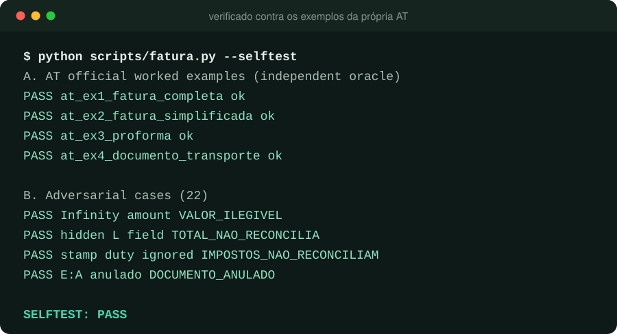
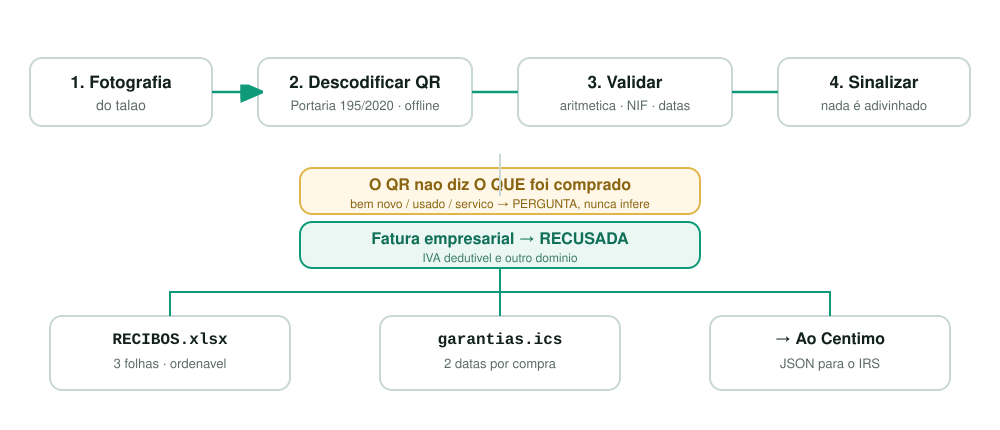
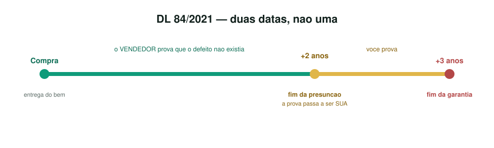

<p align="center">
  <picture>
    <source media="(prefers-color-scheme: dark)" srcset="https://raw.githubusercontent.com/yeer0s/recibosegarantia/main/docs/images/recibos-wide-dark-1k.svg">
    
  </picture>
</p>

<p align="center">
  <a href="https://github.com/yeer0s/recibosegarantia/actions/workflows/gates.yml"></a>
  <a href="LICENSE"></a>
  
  
  
  <a href="https://mowei.pt"></a>
  <a href="https://buymeacoffee.com/letsmoweis"></a>
  <a href="https://ko-fi.com/letsmowei"></a>
</p>

<h3 align="center">
  Fotografa o talão.<br>
  Fica estruturado, validado, avisado.<br>
  Nada sai da tua máquina.
</h3>

<p align="center">
  <b>Offline receipt capture, validation and guarantee tracking for Portugal.</b><br>
  Decodes the mandatory QR code · reconciles against the tax authority's own<br>
  worked examples · tells you when your guarantee actually runs out.<br>
  <sub><a href="README.pt.md">🇵🇹 Ler em português</a></sub>
</p>

---

:fire: ***News*** :fire:

- **[Jul 2026]** First public release — QR decode, validation, guarantee tracking, iCal export
- **[Jul 2026]** Golden fixtures are the **AT's own four worked examples**, not hand-written ones
- **[Jul 2026]** Full field model: `I*` continente, `J*` Açores, `K*` Madeira, `L` não sujeito, `M` imposto do selo, `P` retenções — an earlier draft knew only `I*` and mis-reconciled every regional invoice
- **[Jul 2026]** Two guarantee dates per purchase, because DL 84/2021 has two — and the one nobody knows about is the 2-year mark
- **[Jul 2026]** Companion to [Ao Cêntimo](https://github.com/yeer0s/AoCentimo), the offline IRS engine

---

## Your receipts are none of an API's business

A photo of a receipt carries more than numbers: your name, your address, the pharmacy you
went to, what you were treated for. Every "AI receipt scanner" ships that to somebody
else's server.

**This one has no code path that could.**

<p align="center">
  
</p>

- **Zero network calls.** `scripts/offline_audit.py` parses every shipped file and fails on
  any networking, `subprocess` or `ctypes` import, any shell-out (`os.system`, `os.popen`,
  `os.exec*`), any dynamic import, and any builtin `eval`/`exec`. CI re-runs **every gate
  with the socket layer disabled** — anything phoning home crashes the build.
- **No dependencies.** Python 3.10+ standard library. `openpyxl` is optional: without it
  you get CSV with identical columns.
- **Runs on a local model.** Ollama, llama.cpp, LM Studio, an air-gapped box.
- **Structural, not promised.** Stated precisely: the audit is a *static check, not a
  sandbox*. It catches the accidental and the obvious, not a determined malicious
  contributor. See [SECURITY.md](SECURITY.md).

## How it works

<p align="center">
  
</p>

Since **Portaria n.º 195/2020** every Portuguese invoice carries a QR code with the fields
as *structured data* — NIFs, date, document number, ATCUD, the full IVA breakdown, totals.
Decoding it is local, instant, and **cannot hallucinate**. OCR is the fallback for
pre-2022 and faded receipts, never the primary path.

## The two things it refuses to do

**It never guesses what you bought.** There is no field for it — not in Portaria 195/2020,
not anywhere. The QR carries *who, when, how much, and the tax split*. Every proxy fails:
23% IVA covers most goods **and** most services; `FT`/`FS` are billing formats; a garage
sells parts and labour on one invoice. So `tipo` defaults to `por_classificar` and **no
guarantee date is produced until a human says what it was.** An unconditional three years
would tell you your haircut is guaranteed until 2029 — a deadline that does not exist.

**It refuses business invoices outright.** A bill issued to a company engages *IVA
dedutível* and the commercial guarantee regime, not the consumer one. Different domain,
different risk, so the skill stops rather than producing confidently wrong numbers.

## Guarantee: two dates, not one

<p align="center">
  
</p>

Verified against the consolidated text of **DL 84/2021**, because "two years" is the common
answer and it is **wrong for Portugal**:

| Kind | Liability | Presumption | Article |
|---|---|---|---|
| Bem móvel novo | **3 years** | 2 years | 12.º n.º 1 · 13.º n.º 1 |
| Bem móvel usado | 3 years, reducible to **18 months** by express agreement | 2 years | 12.º n.º 3 |
| Recondicionado | 3 years, disclosure mandatory on the invoice | 2 years | 12.º |
| Bem imóvel | 10 yrs structural / 5 yrs other | 2 years | 23.º n.º 1 |
| **Serviço comum** | **outside DL 84/2021 entirely** | — | 1.º |

In years 1–2 the **seller** must prove the defect wasn't there at delivery. From 2 to 3 you
still have rights but **you** carry the burden of proof — same receipt, materially weaker
position. That gap is why the calendar emits **two** events per purchase, not one.

There is **no deadline to report a defect** (art. 12.º n.º 5, abolished) — but once you
report it, rights lapse **2 years later** (art. 17.º n.º 1).

## Install

```bash
git clone https://github.com/yeer0s/recibosegarantia.git
cp -r recibosegarantia ~/.claude/skills/recibos-e-garantia
```

## Verify every claim yourself, in 30 seconds

```bash
cd recibosegarantia
python scripts/fatura.py --selftest        # AT worked examples + 22 adversarial cases
python scripts/garantia.py --selftest      # DL 84/2021 periods + RFC 5545 iCal
python scripts/planilha.py --selftest      # three sheets, CSV fallback
python scripts/offline_audit.py --selftest # prove the privacy audit can fail
python scripts/sweep.py                    # 56 checks
```

All exit `0`. Try it with your Wi-Fi off.

## Why trust this one

**The golden fixtures were written by the tax authority, not by us.** All four cases in
`assets/at-examples.json` are transcribed verbatim from section 5 of the AT's QR
specification. Example 1 spans continente + Açores + Madeira + stamp duty + withholding and
reconciles to **€513,600.58** exactly.

That matters because the sibling project [Ao Cêntimo](https://github.com/yeer0s/AoCentimo)
shipped a corpus that was entirely self-derived, and was consequently blind to a superseded
tax rate for a year with every test green. **A corpus derived from the thing it checks
cannot fail you, and that is the problem.** This one can.

| Guarantee | How it is enforced |
|---|---|
| **A check that cannot run must FLAG, never SKIP** | An unparseable amount used to disable the whole arithmetic check silently, letting €9,999,999.99 through with zero flags. Every "cannot evaluate" branch now raises a flag |
| **A validator may REJECT; never CONFIRM** | The NIF check digit passes 1.53% of single-digit corruptions — `100000010` and `600000010` differ by one digit and are both valid |
| **Provenance travels with the value** | A QR field is a transcription; an OCR field is a reading. They never reach the spreadsheet with equal confidence |
| **Every gap states its direction of error** | The sweep fails if one doesn't |

The reconciliation, verified cent-exact against all four official examples:

```
N = Σ(IVA: I4,I6,I8 · J4,J6,J8 · K4,K6,K8) + M (imposto do selo)
O = Σ(bases: I2,I3,I5,I7 · J2,J3,J5,J7 · K2,K3,K5,K7) + L (não sujeito) + N
P (retenções na fonte) is NOT part of O
```

An earlier draft built from a practitioner blog knew only `I*`, and therefore mis-reconciled
**every** Azores, Madeira, stamp-duty and withholding invoice — and treated `N` as IVA alone
when it is IVA **plus** stamp duty.

## Output

| Sheet | Contents |
|---|---|
| `RECIBOS` | every invoice, every field, flags in their own column |
| `GARANTIAS` | goods only, both milestone dates, legal basis, warnings |
| `REVISAO` | everything flagged — so broken rows never hide among clean ones |

Plus `garantias.ics` (RFC 5545, two events per purchase, 30-day lead, alarm attached) and a
JSON sidecar that [Ao Cêntimo](https://github.com/yeer0s/AoCentimo) ingests directly.

## ⚠️ Not tax or legal advice

**This is an automated reading of a document, not a professional opinion, and no
professional relationship is created. Verify every figure with a contabilista certificado
(OCC) before filing anything, and verify every guarantee deadline with the seller or
[DECO](https://www.deco.proteste.pt/) before making a claim.**

Only the [Autoridade Tributária](https://info.portaldasfinancas.gov.pt) and the Diário da
República are authoritative. A calculator cannot sign your Modelo 3, cannot represent you
before the AT, and cannot make a guarantee claim for you. Full terms:
**[DISCLAIMER.md](DISCLAIMER.md)**.

## Free, and staying free

MIT. No paid tier, no email wall, no telemetry.

Built by **[mowei.pt](https://mowei.pt)** — free comparison tools and plain-Portuguese
guides for energy, telecoms, insurance, banking, credit and grants.

<p align="center">
  <a href="https://mowei.pt"></a>
</p>

<p align="center">
  <a href="https://mowei.pt"><b>🇵🇹 mowei.pt — ferramentas gratuitas</b></a>
  &nbsp;·&nbsp;
  <a href="https://buymeacoffee.com/letsmoweis"></a>
  &nbsp;·&nbsp;
  <a href="https://ko-fi.com/letsmowei"></a>
</p>

Support is entirely optional and always will be — the project is complete without it.

## Contributing

In order of value:

1. **A wrong number or a wrong citation** — a period, article or field semantic that
   contradicts the source it names. The most valuable thing you can send.
2. **OCR for receipts without a QR code** — pre-2022 and faded thermal, currently
   hand-entry only.
3. **Estado do documento `F`/`S`/`R`** — their deduction consequence is not established
   from a primary source, so they are flagged and never trusted. A citation would close it.
4. **QR authenticity** — `Q`/`R` are parsed and never verified.

Every PR keeps all gates at exit `0`, and every new constant needs its citation.

## License

[MIT](LICENSE) — use it, fork it, ship it commercially. A link back to
[mowei.pt](https://mowei.pt) is appreciated, never required.
